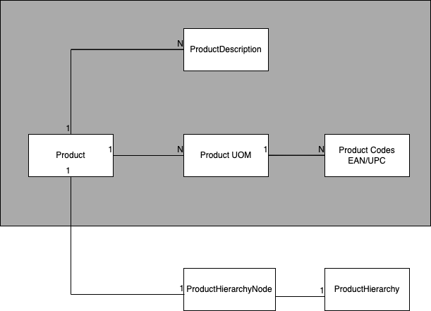

# Products and Product Hierarchy
Products are produced by the manufacturer and sold to customers/retailers. 
They are part of a hierarchy of products and there are other ways to group products, e.g. by brand, by product line, etc. 

## Product
A product is identified by a unique identifier. A product can have multiple descriptions, usually divided by language. Products are sold in different bulk sizes, these are stored as unit of measures (UOM). This can be a case, a pallet, a box, etc.
Each unit of measure of a product can have multiple product codes. These are used to identify the product in the retailer's system. These can be the bar codes you see on the back of the packaging (UPC, EAN, SKU) of a product or RFID chips. Different UOMs have different product codes.

As manufacturers evolve their products, they create new products to track the new requirements and production processes. For example, a winter edition Coca Cola can be a different product with a different unique identifier than a regular Coca Cola can, despite having the same size and price. 

Products are part of a product hierarchy and sortiment groups. Manufacturers use them to group products by brand, product line, etc.

## Product Hierarchy

Products are part of a hierarchy. The hierarchy is a tree structure that represents the relationships between products, where products represent the nodes. The hierarchy is used to group products by brand, product line, etc. Manufacturers can define how this hierarchy should look like. 
This could be an example for Coca Cola: 
- Beverages
  - Soft Drinks
    - Coca Cola
      - Coca Cola Regular
        - Coca Cola Regular 0.33L
          - Coca Cola Regular 0.33L Can
          - Coca Cola Regular 0.33L Can Winter Edition
        - Coca Cola Regular 0.33L Bottle
          - 
        - Coca Cola Regular 0.5L
        - Coca Cola Regular 1.5L
        - 
      - Coca Cola Light
      - Coca Cola Zero
      - ...
    - Fanta
    - Sprite
    - ...
  - Water
    - Dasani
    - Smart Water
    - ...
  - Energy Drinks
  - ...

## Products in the context of promotions
Products are used in promotions to define the products that are part of the promotion. A promotion can be targeted to a specific product, a group of products, or all products. Coca Cola could decide to run a promotion for a specific Winter edition can that has a different design. Or they could decid to run a promotion for all Coca Cola products.
There is also the concept of a product group, which is not reflected in the hierarchy. This could be for example all products in a can. This is reflected through property labels within the product master data. 
