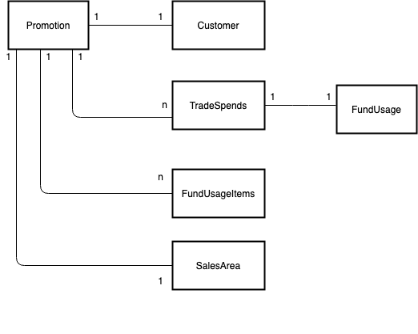

# Promotion

Promotions represent the planning aspect of a negotiated contract between a manufacturer and a retailer. A promotion is a marketing activity used by industries that sell into the retail channel or through brokers or wholesalers. A trade promotion takes place within a specific time period and aims to increase brand capital, brand awareness, and market share. It is also used to increase sales volume or to launch new products or product lines.

## Promotion Header
A trade promotion has a header that provides overview information about the trade promotion, such as the intended key account, the product planning basis, the trade promotion objective, funds plan details, and trade promotion status. Assignment blocks contain specific information pertaining to, for example, trade promotion dates, products, and causals.

## Promotion Status
The default statuses are created, approved, locked, released, finished and rejected. The important statuses are released which means the promotion is in execution and finished/rejected means the promotion is no longer in execution.

## Promotion Trade Spends
A trade spend is 
The unique combination of spend type, spend category, spend method and discount method which will point to an ExpenseType.

1. 	**SpendType**
    The type of trade spend usually fixed or variable

2. 	**SpendMethod**
    Spend method defines how the promotions budget is spent

3. 	**DiscountMethod**
    The method which the dicount is offered to the customer/consumer in the promotion (e.g. unit, percentage, etc.)

4.  **SpendCategory**
    SpendCategory to define more detail about the spend type (e.g. percentage, rate, display, feature, etc.)

5. 	**ExpenseType**
    Categorizations of how money is spent in a fund (e.g. display, advertising, shelf space, etc.)

## Fund Usage

Each TradeSpend is associated with a fund usage when the promotion is released for usage. these represent the reserved parts and consumption of the fund budget. 
The more volume of the products are sold, the more funds are reserved and later paid out to the retailer after a proof of performance was delivered.

## Fund Usage Items

These are the individual products/product hierarchies/product groups and how make up the reservation and consumption of the fund usage.

## Example of Promotion
    TODO